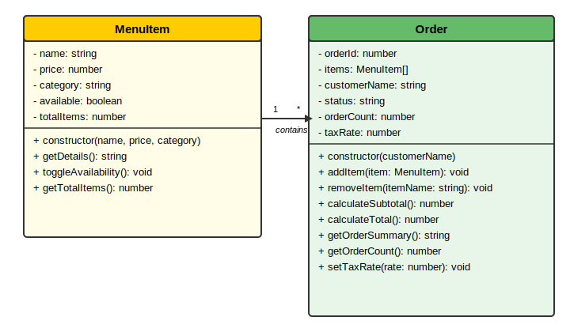
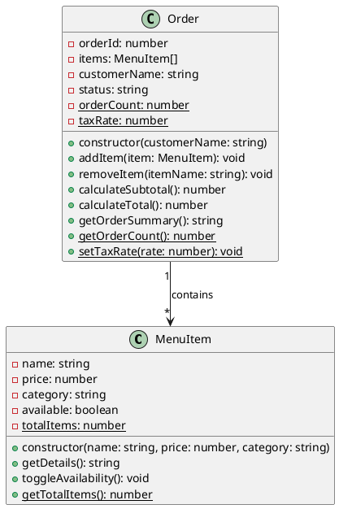

# Restaurant Order Management System

## Problem Domain Description

The **Restaurant Order Management System** is a software solution that allows restaurant staff to manage menu items and process customer orders efficiently. It solves the problem of tracking what dishes are available, calculating order totals, applying discounts, and monitoring how many orders have been placed. Restaurant managers, waitstaff, and cashiers use this system daily to streamline operations.

## UML Class Diagram



### Class Diagram (PlantUML Source)



## Code Implementation

See [`src/index.js`](./src/index.js) for the full implementation with usage examples.

## How to Run

```bash
node src/index.js
```
